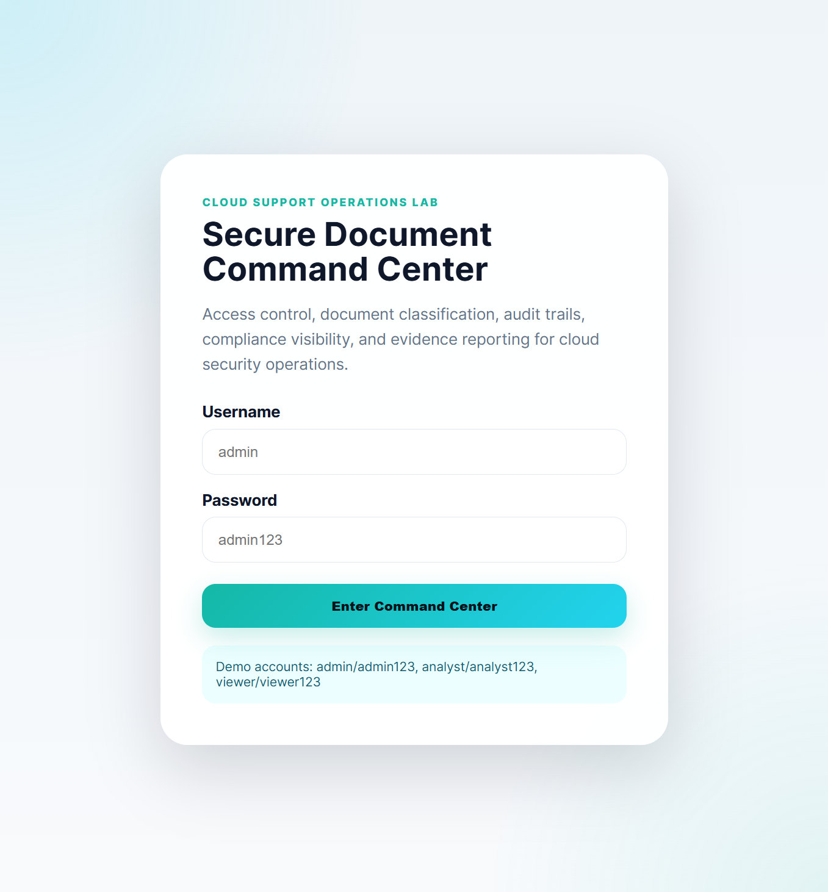
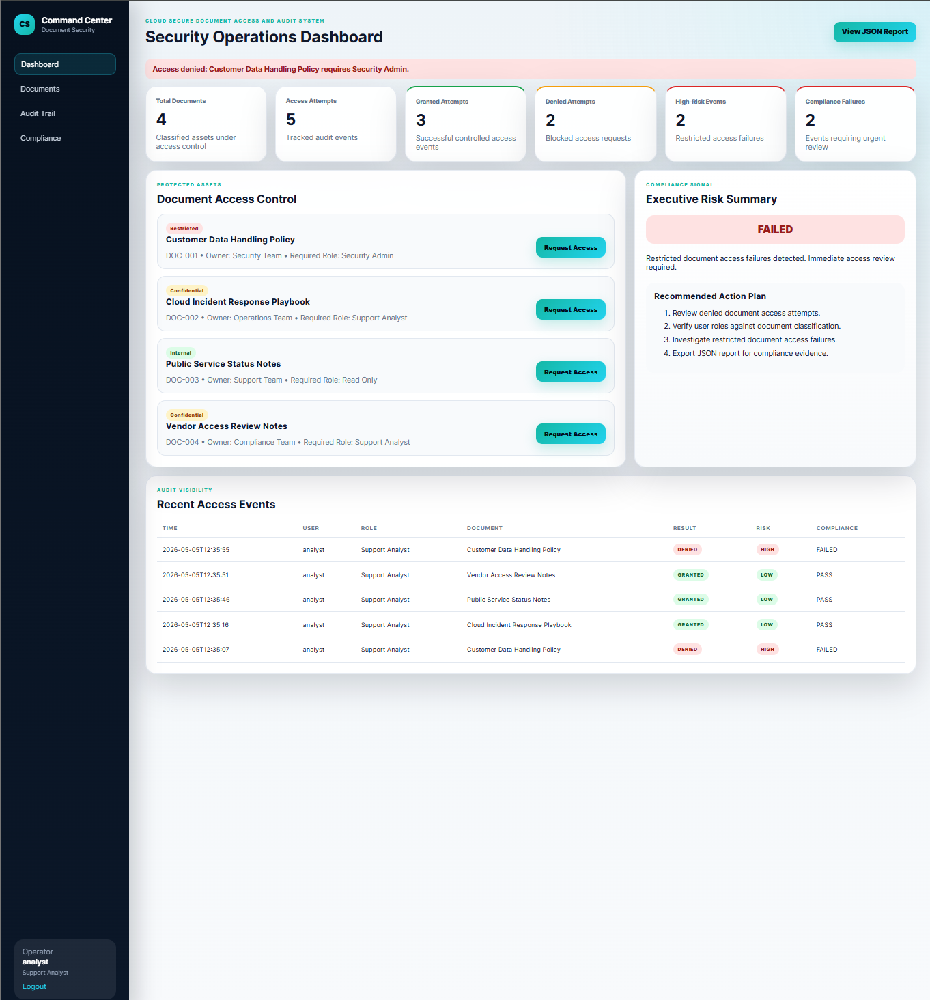

# Cloud Access Control And Audit Compliance System

## Overview

This project simulates a cloud secure document access and audit compliance workflow. It includes a Flask-based command center for reviewing protected documents, requesting access, enforcing role-based permissions, tracking access attempts, classifying risk, and generating compliance evidence.

The system reflects how cloud support, SOC, and security operations teams monitor sensitive document access, investigate denied requests, and produce audit-ready reports.

---

## Dashboard Preview

### Login Page

### Security Operations Dashboard

---

## Core Features

- Flask-Based Secure Document Portal
- Role-Based Access Control
- Document Sensitivity Classification
- Access Granted And Access Denied Tracking
- Security Event Classification
- Audit Trail Generation
- Compliance Status Reporting
- Executive Dashboard Metrics
- JSON Compliance Report Endpoint
- Enterprise-Style Command Center UI

---

## Demo Accounts

| Username | Password | Role |
|---|---|---|
| admin | admin123 | Security Admin |
| analyst | analyst123 | Support Analyst |
| viewer | viewer123 | Read Only |

---

## Simulated Access Rules

| Classification | Required Role |
|---|---|
| Restricted | Security Admin |
| Confidential | Support Analyst |
| Internal | Read Only |

A higher role can access documents assigned to lower roles.

---

## Dashboard Workflow

1. User logs into the command center.
2. The dashboard displays classified documents.
3. User requests access to protected documents.
4. The system evaluates role permissions.
5. Access is granted or denied.
6. Each attempt is written to the audit log.
7. Risk level and compliance status are assigned.
8. The dashboard updates executive metrics.
9. JSON compliance evidence can be exported.

---

## Project Structure

- app.py
- templates/login.html
- templates/dashboard.html
- static/css/styles.css
- data/portal_users.json
- data/documents.json
- logs/document_access_audit.log
- reports/access_compliance_report.json
- screenshots/
- README.md
- requirements.txt

---

## How To Run

Install dependencies:

pip install -r requirements.txt

Run the Flask app:

python app.py

Open:

http://127.0.0.1:5000

---

## JSON Compliance Report

After generating access events in the dashboard, open:

http://127.0.0.1:5000/report

This returns a structured JSON report containing access attempts, denied requests, high-risk events, and compliance failures.

---

## Real-World Relevance

This project reflects cloud support and security operations responsibilities:

- Validating Secure Access To Sensitive Documents
- Monitoring Denied Access Attempts
- Tracking Audit Evidence
- Identifying High-Risk Access Events
- Supporting Compliance Visibility
- Producing Structured Reports For Investigation
- Communicating Access Risk Clearly Through A Dashboard

