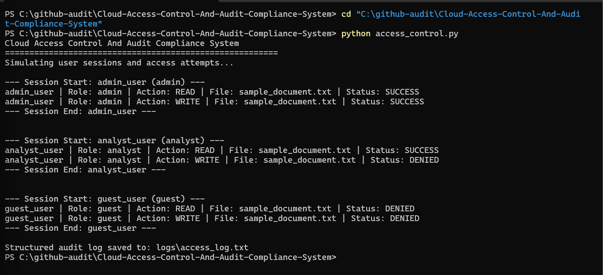
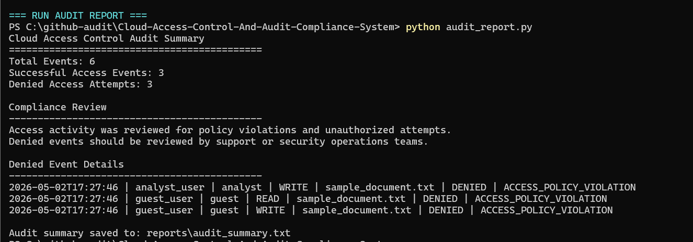

# Cloud Access Control And Audit Compliance System

## Overview

This project simulates a cloud access control and audit compliance workflow used to track user activity, enforce permissions, classify access events, and generate audit summaries.

It is designed to reflect how cloud support, SOC, and security operations teams review access behavior, investigate denied actions, and prove what happened through structured logs.

---

## Session Output Preview

The screenshot below shows simulated user sessions where admin, analyst, and guest users attempt to read and write an internal document.

---

## Audit Summary Preview

The screenshot below shows the generated audit summary, including total events, successful access events, denied access attempts, and policy violation details.

---

## Project Objective

To simulate how security and cloud support teams answer access-control questions:

- Who accessed the file?
- What action did the user attempt?
- Was the action allowed or denied?
- Was the event classified as normal activity or a policy violation?
- Can the activity be summarized for audit review?

---

## Simulated Environment

- Internal Document Access System
- Role-Based User Permissions
- Session-Based User Activity
- Structured Access Logs
- Audit Summary Report For Compliance Review

---

## Access Roles

| Role | Read Access | Write Access |
|---|---:|---:|
| Admin | Yes | Yes |
| Analyst | Yes | No |
| Guest | No | No |

---

## Security Event Classification

The system classifies each access attempt as:

- AUTHORIZED_ACTIVITY when the user action is allowed
- ACCESS_POLICY_VIOLATION when the user action is denied

---

## Audit Workflow

1. Load user accounts from JSON data
2. Simulate user sessions
3. Attempt read and write actions
4. Enforce role-based permissions
5. Write structured audit logs
6. Generate an audit summary report
7. Review denied access attempts for compliance

---

## Project Structure

- data/users.json
- files/sample_document.txt
- logs/access_log.txt
- reports/audit_summary.txt
- screenshots/session-output.png
- screenshots/audit-summary.png
- access_control.py
- audit_report.py
- README.md

---

## Technologies Used

- Python
- JSON
- Role-Based Access Control
- Audit Logging
- Compliance Reporting
- Security Event Classification

---

## How To Run

Run the access-control session simulation:

python access_control.py

Generate the audit summary:

python audit_report.py

Then review:

- logs/access_log.txt
- reports/audit_summary.txt

---

## Planned Enhancements

- Add User Authentication Simulation
- Add Role-Based Dashboard Views
- Export Audit Reports To CSV
- Add Severity Levels For Denied Events
- Add Cloud IAM-Style Policy Rules
- Add Automated Compliance Alerts
- Add Admin Review Workflow

---

## Real-World Relevance

This project reflects security operations and cloud support responsibilities:

- Reviewing Access Activity
- Enforcing Permission Rules
- Investigating Denied Access Attempts
- Producing Audit Evidence
- Supporting Compliance Review
- Communicating Security Findings Clearly

---

## Professional Positioning

This project is designed as an entry-level access control, audit logging, and compliance investigation simulation.

It demonstrates the ability to track user activity, enforce permissions, classify policy violations, and generate audit-ready evidence.
